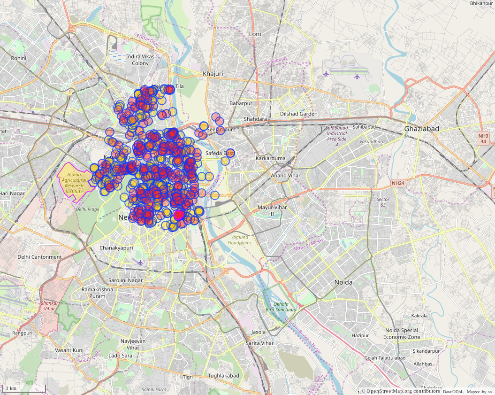

# OpenStreetMap Clustering of points of interest

## Aim: ​ Identify commercial centers using Points of Interest (POI) data

## Data Source

OpenStreetMap provides the spatial data for the required analysis. <br>

POI (OSM) data:
https://www.openstreetmap.org/#map=11/28.6518/77.2219


You can use overpy (a python frontend for overpass API of OSM) to get OSM data for the
desired city.


## Overpass Query 

The overpass query used here to get the data is as follow:

```
/*
This has been generated by the overpass-turbo wizard.
The original search was:
“amenity=* around "Delhi"”
*/
[out:json][timeout:25];
// adjust the search radius (in meters) here
{{radius=5000}}
// gather results
(
  // query part for: “amenity=*”
  node["amenity"](around:{{radius}},{{geocodeCoords:Delhi}});
  way["amenity"](around:{{radius}},{{geocodeCoords:Delhi}});
  relation["amenity"](around:{{radius}},{{geocodeCoords:Delhi}});
);
// print results
out body;
>;
out skel qt;
```

This query provides the data for all the amenities in Delhi within a 5 km radius


## Visuals

The point of interest over the map area is as follow:



## Analysis 

The analysis and clustering of point of interests is done in the following jupyter file:

* [main.ipynb](notebook/main.ipynb)


## To do

* Generate More Visualisations.
* use other clustering methods and compare.